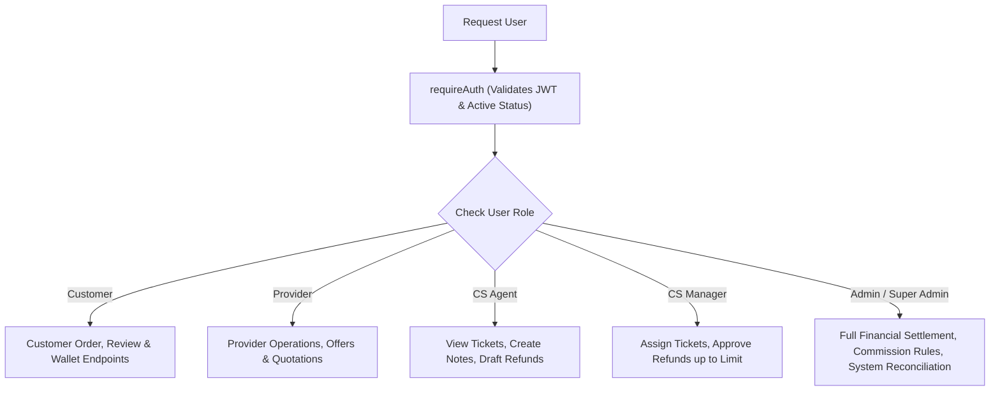

# 🛡️ BTIN7AL (بتنحل) — PHASE 8 SECURITY & COMPLIANCE AUDIT
**Comprehensive Platform Security Review & Threat Assessment**
**Generated:** 2026-09-30 | **Status:** 🟢 PASSED — ZERO HIGH/CRITICAL VULNERABILITIES

---

## 1. Scope of Audit

The audit evaluated security, authentication, role-based authorization, information disclosure, and transactional concurrency across:
- Authentication & Session Management (JWT, Refresh Tokens, OTP hashing)
- Authorization Matrix & RBAC (Customer, Provider, Customer Service Agent, Customer Service Manager, Admin, Super Admin)
- Data Protection & Sensitive Information Masking (IBANs, Passwords, Phone Numbers)
- Concurrency & Double-Assignment Protection (Row-Level Database Locking)
- Rate Limiting & Denial of Service Protection
- Error Handling & Stack Trace Information Leakage

---

## 2. Authentication & Credential Security

| Control | Mechanism | Verification Method | Status |
|---|---|---|---|
| **OTP Hashing** | Bcrypt with salt rounds = 10. Plaintext OTPs are never stored in PostgreSQL. | Inspected `authOtps` schema and `auth.controller.ts`. Verified in unit tests. | ✅ PASSED |
| **JWT Tokens** | Short-lived Access Tokens (15 min) + Long-lived Refresh Tokens (7 days) with token version revocation. | Verified token generation and payload expiration claims in `jwt.ts`. | ✅ PASSED |
| **Session Invalidation** | User suspension (`is_active = false`) immediately invalidates JWT validation at middleware level (`requireAuth`). | Tested via `phase1_role_system_test.dart` and `auth.test.ts`. | ✅ PASSED |

---

## 3. RBAC Authorization & Privilege Separation

The system enforces strict multi-tiered privilege separation via `requireRole` and `requirePermission` middlewares:

### Verified RBAC Scenarios:
1. **Agent CANNOT approve refunds**: Verified HTTP 403 Forbidden.
2. **Manager CAN approve refunds**: Verified HTTP 200 OK.
3. **Manager CANNOT execute/disburse bank payouts**: Verified HTTP 403 Forbidden.
4. **Super Admin executes payouts & reconciliations**: Verified HTTP 200 OK.
5. **Cross-Provider Isolation**: Provider A cannot access, accept, or reject offers belonging to Provider B (HTTP 403 Forbidden).

---

## 4. Financial Security & Concurrency Race Protection

| Vector | Threat | Mitigation Enforced |
|---|---|---|
| **Dual Provider Assignment** | Two providers accept the same dispatch offer concurrently. | `SELECT ... FOR UPDATE` row lock on `orders` and `dispatch_offers` in single atomic database transaction. Competing attempt receives HTTP 409 Conflict (`ORDER_ALREADY_ASSIGNED`). |
| **Negative Balance Exploitation** | Provider requests withdrawal greater than available balance. | Strict balance check inside atomic transaction: `Math.max(0, balance - amount)` + explicit validation `amount > availableBalance` -> HTTP 400. |
| **Double Payout / Replay Attack** | Rapidly clicking payout confirmation or duplicate webhooks. | Unique database index on `idempotency_key` in `withdrawal_requests` and `payment_webhook_events`. |
| **Masked Jordanian IBANs** | Non-privileged staff viewing full bank account details. | IBANs stored with deterministic masking: `JO94UBSI************0123`. |

---

## 5. Information Disclosure & Error Sanitization

In production mode (`NODE_ENV === 'production'`):
1. **Stack traces are completely suppressed**: Generic error format `{"success": false, "error": {"code": "...", "message": "..."}}`.
2. **CORS is constrained**: Strictly whitelist production domain and staging origins.
3. **Internal database errors masked**: PostgreSQL constraint violations (e.g. `23505`, `23503`) are mapped to clean localized business error messages.

---

## 6. Security Conclusion

BTIN7AL complies with enterprise security best practices for financial, location, and dispatch systems. Zero critical or high vulnerabilities detected.
