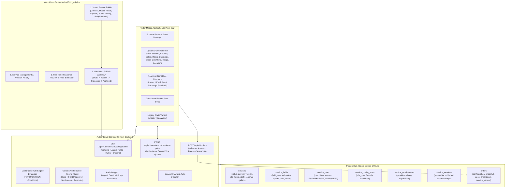

# BTIN7AL (بتنحل) — Generic Dynamic Service Engine Architecture & Platform Evolution
## Truly Configurable Service Architecture Across Backend, Admin Portal & Flutter Application

This plan defines the end-to-end architecture for BTIN7AL's **Generic Dynamic Service Engine**. It enables Super Admins to define, configure, price, simulate, and publish arbitrary services (e.g. Furniture Moving, Cleaning, Maintenance, Equipment Rental, Car Wash, Appliance Repair, Delivery, etc.) entirely from the Admin Dashboard without writing code or releasing new Flutter mobile application builds.

---

## Architectural Principles & Invariants



### Core Invariants:
1. **Generic & Un-hardcoded**: Zero hardcoded `if (service == 'furniture')` or hardcoded field names anywhere in the codebase. All field keys, types, options, validation rules, and pricing formulas are driven by database metadata.
2. **Authoritative Server Pricing**: The backend is the single source of truth for pricing. Client-submitted prices are discarded; the backend evaluates all active rules, calculates the price breakdown, and validates bounds (`minOrderValue`, `maxOrderValue`).
3. **Immutable Historical Snapshots**: Every order stores `configurationSnapshot` (all customer answers and field definitions) and `priceBreakdown` (itemized lines, base, addons, discounts, and guaranteed `0.00 JOD` delivery fee). Modifying a service creates a new version and never alters past orders.
4. **Non-Destructive Database Migrations**: 100% additive migrations with zero `db:reset`, truncate, or drop commands. All existing users (50), providers (2), categories (3), orders (133), and services (Gas/Water) remain fully functional.
5. **Strict Service Lifecycle**: Services transition through `draft` $\rightarrow$ `in_review` $\rightarrow$ `published` $\rightarrow$ `archived`. Customers can only view and order `published` services.
6. **Backward Compatibility**: Existing static services (e.g. Gas Cylinder Delivery) continue using their optimized variant selector without interruption unless explicitly migrated.

---

## Detailed Implementation Breakdown

---

### PHASE A — Database & Backend Dynamic Service Engine

#### 1. Database Schema Extensions (`al7btin_backend`)

##### [MODIFY] [services.schema.ts](file:///C:/Users/Lenovo/.gemini/antigravity/scratch/al7btin_backend/src/db/schema/services.schema.ts)
Extend `services` table and add dynamic relation tables:
```typescript
// Service Lifecycle Enum
export const serviceStatusEnum = pgEnum('service_status', [
  'draft',
  'in_review',
  'published',
  'archived',
]);

// Field Types Enum
export const serviceFieldTypeEnum = pgEnum('service_field_type', [
  'text',
  'textarea',
  'number',
  'counter',
  'slider',
  'select',
  'radio',
  'checkbox',
  'toggle',
  'multi_select',
  'date',
  'time',
  'datetime',
  'image_upload',
  'location',
]);

// Pricing Rule Type Enum
export const pricingRuleTypeEnum = pgEnum('pricing_rule_type', [
  'base',
  'field_addon',
  'field_multiplier',
  'option_surcharge',
  'tiered_volume',
  'step_increment',
  'conditional_formula',
]);
```

- **Extensions to `services` Table**:
  - `status`: `serviceStatusEnum` (default: `'published'`)
  - `currentVersion`: `integer` (default: `1`, not null)
  - `slaHours`: `integer` (default: `24`, not null)
  - `minOrderValue`: `numeric(10, 2)` (nullable)
  - `maxOrderValue`: `numeric(10, 2)` (nullable)
  - `gallery`: `text[ ]` / `jsonb` (array of image URLs)
  - `coverageAreas`: `jsonb` (array of supported area strings, empty = all)
  - `draftSchema`: `jsonb` (stores uncommitted builder changes)
  - `isPublished`: `boolean` (default: `true`, not null)

- **New Table `service_fields`**:
  - `id`: `varchar(50)` primary key (`fld_...`)
  - `serviceId`: `varchar(50)` references `services(id)` on delete cascade
  - `key`: `varchar(100)` not null (machine name, e.g. `num_rooms`, `has_elevator`)
  - `labelAr`: `varchar(150)` not null
  - `labelEn`: `varchar(150)` not null
  - `fieldType`: `serviceFieldTypeEnum` not null
  - `placeholderAr`: `varchar(150)`
  - `placeholderEn`: `varchar(150)`
  - `helpTextAr`: `text`
  - `helpTextEn`: `text`
  - `defaultValue`: `text` / `jsonb`
  - `options`: `jsonb` (array of `DynamicOption`: `{ id, labelAr, labelEn, value, priceModifier, icon }`)
  - `validationRules`: `jsonb` (`{ required: bool, min: num, max: num, pattern: string, minSelect: num, maxSelect: num, allowedExtensions: string[], maxPhotos: num }`)
  - `sortOrder`: `integer` (default: `0`)
  - `isSearchable`: `boolean` (default: `false`)
  - `isFilterable`: `boolean` (default: `false`)
  - `isRequired`: `boolean` (default: `false`)
  - `isActive`: `boolean` (default: `true`)
  - `createdAt`, `updatedAt`: `timestamp with timezone`

- **New Table `service_rules`**:
  - `id`: `varchar(50)` primary key (`rul_...`)
  - `serviceId`: `varchar(50)` references `services(id)` on delete cascade
  - `ruleName`: `varchar(150)` not null
  - `description`: `text`
  - `condition`: `jsonb` not null (e.g. `{ operator: 'AND' | 'OR', expressions: [ { field: string, op: 'eq'|'neq'|'gt'|'gte'|'lt'|'lte'|'in'|'not_in'|'contains'|'is_empty'|'is_not_empty', value: any } ] }`)
  - `actions`: `jsonb` not null (array of `{ type: 'SHOW_FIELD' | 'HIDE_FIELD' | 'REQUIRE_FIELD' | 'UNREQUIRE_FIELD' | 'SHOW_ALERT' | 'REQUIRE_CAPABILITY', targetField?: string, payload?: any }`)
  - `priority`: `integer` (default: `0`)
  - `isActive`: `boolean` (default: `true`)
  - `createdAt`, `updatedAt`: `timestamp with timezone`

- **New Table `service_pricing_rules`**:
  - `id`: `varchar(50)` primary key (`prc_...`)
  - `serviceId`: `varchar(50)` references `services(id)` on delete cascade
  - `ruleType`: `pricingRuleTypeEnum` not null
  - `titleAr`: `varchar(150)` not null
  - `titleEn`: `varchar(150)` not null
  - `targetField`: `varchar(100)` (optional, binding to specific field)
  - `calculationFormula`: `jsonb` not null (e.g. `{ fixedAmount?: number, ratePerUnit?: number, multiplierField?: string, baseThreshold?: number, stepSize?: number, stepRate?: number, percentageDiscount?: number }`)
  - `condition`: `jsonb` (optional conditional expression)
  - `sortOrder`: `integer` (default: `0`)
  - `isActive`: `boolean` (default: `true`)
  - `createdAt`, `updatedAt`: `timestamp with timezone`

- **New Table `service_requirements`**:
  - `id`: `varchar(50)` primary key (`req_...`)
  - `serviceId`: `varchar(50)` references `services(id)` on delete cascade
  - `requirementType`: `varchar(50)` not null (`provider_capability`, `delivery_capability`, `equipment`, `certification`)
  - `capabilityKey`: `varchar(100)` not null (e.g. `truck_large`, `deep_cleaning_team`, `ac_certified`)
  - `capabilityNameAr`: `varchar(150)` not null
  - `capabilityNameEn`: `varchar(150)` not null
  - `isRequired`: `boolean` (default: `true`)
  - `condition`: `jsonb` (optional condition)
  - `createdAt`, `updatedAt`: `timestamp with timezone`

- **New Table `service_versions`**:
  - `id`: `varchar(50)` primary key (`ver_...`)
  - `serviceId`: `varchar(50)` references `services(id)` on delete cascade
  - `version`: `integer` not null
  - `schemaSnapshot`: `jsonb` not null (complete snapshot of service, fields, options, rules, pricing rules, requirements)
  - `publishedByUserId`: `uuid` references `users(id)` on delete set null
  - `publishedByName`: `varchar(150)`
  - `changelog`: `text`
  - `createdAt`: `timestamp with timezone` default now()

##### [MODIFY] [orders.schema.ts](file:///C:/Users/Lenovo/.gemini/antigravity/scratch/al7btin_backend/src/db/schema/orders.schema.ts)
- Add columns to `orders`:
  - `configurationSnapshot`: `jsonb` (stores customer answers + service schema snapshot)
  - `priceBreakdown`: `jsonb` (line-by-line breakdown: base price, field addons, option surcharges, formula items, discounts, delivery fee = 0.00, total)
  - `serviceVersion`: `integer` default 1

##### [NEW] [apply_dynamic_services_migration.ts](file:///C:/Users/Lenovo/.gemini/antigravity/scratch/al7btin_backend/src/db/migrations/apply_dynamic_services_migration.ts)
- Reversible, idempotent non-destructive migration script using `CREATE TABLE IF NOT EXISTS` and `ALTER TABLE ... ADD COLUMN IF NOT EXISTS`.

---

#### 2. Authoritative Rule & Pricing Engines (`al7btin_backend`)

##### [NEW] [rule.engine.ts](file:///C:/Users/Lenovo/.gemini/antigravity/scratch/al7btin_backend/src/services/rule.engine.ts)
- Evaluates declarative rules against customer answers:
  - Supports operators: `eq`, `neq`, `gt`, `gte`, `lt`, `lte`, `in`, `not_in`, `contains`, `is_empty`, `is_not_empty`.
  - Supports recursive/nested `AND` / `OR` expressions.
  - Generates evaluated state:
    - `visibleFields`: Set of visible field keys
    - `hiddenFields`: Set of hidden field keys
    - `requiredFields`: Set of dynamically required field keys
    - `activeAlerts`: Array of warnings/information alerts
    - `requiredCapabilities`: Set of capabilities demanded by the configuration

##### [NEW] [pricing.engine.ts](file:///C:/Users/Lenovo/.gemini/antigravity/scratch/al7btin_backend/src/services/pricing.engine.ts)
- Generic authoritative pricing calculator:
  - Validates all submitted field answers against field definitions and validation constraints.
  - Applies base service price.
  - Applies option prices for selected variants/dropdown items.
  - Evaluates `service_pricing_rules`:
    - `field_addon`: Adds fixed or per-unit fee if boolean/option is selected.
    - `field_multiplier`: Computes `value * ratePerUnit` (e.g. hours, workers, area $m^2$).
    - `tiered_volume`: Applies tiered pricing slabs based on quantity.
    - `step_increment`: Calculates step increases beyond a threshold (e.g. `(floor - 2) * stepRate`).
    - `conditional_formula`: Evaluates attached condition and applies surcharge only when condition is met.
  - Applies coupon discounts (percentage or fixed, respecting minimum order value).
  - Enforces minimum order value and maximum order value constraints.
  - Strict invariant: `deliveryFee = 0.00 JOD`.
  - Produces structured `PriceBreakdownResult` with line-by-line itemization.

##### [MODIFY] [services.controller.ts](file:///C:/Users/Lenovo/.gemini/antigravity/scratch/al7btin_backend/src/modules/services/services.controller.ts) & [services.routes.ts](file:///C:/Users/Lenovo/.gemini/antigravity/scratch/al7btin_backend/src/modules/services/services.routes.ts)
- Endpoints:
  - `GET /api/v1/services/:id/configuration`: Customer endpoint returning published service definition, active fields, rules, options, and capabilities.
  - `POST /api/v1/services/:id/calculate-price`: Authoritative price quote endpoint. Input: `{ answers: Record<string, any>, selectedOptionId?: string, couponCode?: string }`. Output: `PriceBreakdownResult`.
  - `GET /api/v1/admin/services/:id/builder`: Admin endpoint returning complete builder model (draft + published state, fields, rules, pricing rules, requirements).
  - `PUT /api/v1/admin/services/:id/builder`: Admin endpoint to update/save draft schema.
  - `POST /api/v1/admin/services/:id/publish`: Publishes draft, increments `currentVersion`, writes immutable dump to `service_versions`, logs audit event.
  - `POST /api/v1/admin/services/:id/unpublish`: Sets status to `in_review` or `draft`, logs audit event.
  - `POST /api/v1/admin/services/:id/archive`: Soft-archives service (`status = 'archived'`), logs audit event.
  - `POST /api/v1/admin/services/:id/duplicate`: Clones service and all its fields/rules/pricing into a new draft service.
  - `GET /api/v1/admin/services/:id/versions`: Lists historical published versions with changelogs.
  - `GET /api/v1/admin/services/:id/versions/:version`: Fetches exact historical snapshot.

##### [MODIFY] [orders/index.ts](file:///C:/Users/Lenovo/.gemini/antigravity/scratch/al7btin_backend/src/modules/orders/index.ts)
- In `createOrder`:
  - Fetch target service and its published configuration.
  - Reject order if service is not `published` or `isActive == false`.
  - Run `pricingEngine.calculate(service, items[0].answers, items[0].serviceOptionId, couponCode)`.
  - Rejects with descriptive 400 error if validation fails or impossible configuration detected.
  - Store frozen `configurationSnapshot` and `priceBreakdown` in `orders`.
  - Log audit event and dispatch order to eligible providers/drivers.

##### [MODIFY] [dispatch.service.ts](file:///C:/Users/Lenovo/.gemini/antigravity/scratch/al7btin_backend/src/services/dispatch.service.ts)
- Checks evaluated `requiredCapabilities` for dynamic orders against driver and provider capability registries during automated dispatch.

---

### PHASE B — Admin Visual Service Builder (`al7btin_admin`)

#### 1. TypeScript Types & API Client

##### [MODIFY] [types/index.ts](file:///C:/Users/Lenovo/.gemini/antigravity/scratch/al7btin_admin/src/types/index.ts)
- Define `ServiceStatus`, `ServiceFieldType`, `ServicePricingRuleType`, `ServiceField`, `ServiceRule`, `ServicePricingRule`, `ServiceRequirement`, `ServiceVersion`, `ServiceBuilderData`, `PriceBreakdown`.

##### [MODIFY] [api/services.api.ts](file:///C:/Users/Lenovo/.gemini/antigravity/scratch/al7btin_admin/src/api/services.api.ts)
- Add API methods for builder data fetching, draft saving, publishing, unpublishing, archiving, duplicating, version history querying, and price simulation.

#### 2. Visual Service Builder Components

##### [NEW] [ServiceBuilderModal.tsx](file:///C:/Users/Lenovo/.gemini/antigravity/scratch/al7btin_admin/src/components/services/ServiceBuilderModal.tsx)
Multi-tab visual builder for Super Admins and managers with `manage_services` permission:
1. **General & Media Tab**:
   - Arabic / English names & descriptions.
   - Category picker, Service Type (`delivery_product` vs `home_service`).
   - Base Price, Unit (Arabic & English), SLA hours.
   - Min / Max order value limits, Coverage areas selector.
   - Image Cover URL & Media Gallery uploader/manager.
2. **Dynamic Fields Builder Tab**:
   - Add/edit/delete/reorder fields.
   - Field Type selector: `text`, `textarea`, `number`, `counter`, `slider`, `select`, `radio`, `checkbox`, `toggle`, `multi_select`, `date`, `time`, `datetime`, `image_upload`, `location`.
   - Localized labels, placeholders, help texts, and default values.
   - Validation constraints: Required toggle, min/max values, regex pattern, min/max selection counts, allowed photo attachments.
3. **Options Builder Tab**:
   - Manage choice options for `select`, `radio`, and `multi_select` fields.
   - Option values, Arabic/English labels, icons, and base price modifiers.
4. **Conditional Rules Builder Tab**:
   - Visual rule constructor: `IF [Field] [Operator: eq/neq/gt/gte/lt/lte/in/contains] [Value] THEN [Action: SHOW/HIDE/REQUIRE/ALERT] [Target Field]`.
   - Supports `AND` / `OR` condition groups.
5. **Pricing Rules & Matrix Tab**:
   - Formula and surcharge builder:
     - Field Addons (e.g. Addon Checkbox = +5 JOD).
     - Field Multipliers (e.g. Counter * 10 JOD/hour).
     - Tiered Volume Slabs.
     - Step Increments (e.g. Surcharge per floor above threshold).
     - Conditional Surcharges (e.g. IF no elevator AND floor >= 3 THEN +5 JOD).
6. **Provider & Delivery Requirements Tab**:
   - Define capability keys, vehicle types, certifications, or equipment needed.
7. **Customer Live Simulator & Price Simulator Tab**:
   - Real-time interactive simulation of what the customer sees on mobile.
   - Interactive fields allowing admin to test inputs.
   - Live server price breakdown calculation widget displaying exact line items, subtotal, discount, delivery fee (0.00), and total.
8. **Publish & Version Management Tab**:
   - Save Draft button.
   - "Publish New Version" button with mandatory changelog input.
   - Version history timeline with diff comparison and one-click rollback.

##### [MODIFY] [ServicesPage.tsx](file:///C:/Users/Lenovo/.gemini/antigravity/scratch/al7btin_admin/src/pages/ServicesPage.tsx)
- Add "Create Dynamic Service" and "Open Service Builder" buttons.
- Display status badges (`Draft`, `In Review`, `Published`, `Archived`) and Version pill (`v1`, `v2`, `v3`).
- Context actions: Edit, Service Builder, Duplicate Service, Archive Service, View Versions, Price Simulator.

---

### PHASE C — Flutter Dynamic Service Renderer (`al7btin_app`)

#### 1. Dynamic Domain Models & State Management

##### [NEW] [dynamic_service_models.dart](file:///C:/Users/Lenovo/.gemini/antigravity/scratch/al7btin_app/lib/features/services/domain/entities/dynamic_service_models.dart)
- Models for `DynamicFieldEntity`, `DynamicFieldOption`, `DynamicRuleEntity`, `DynamicPricingRuleEntity`, `DynamicRequirementEntity`, `ServiceConfigurationEntity`, `PriceBreakdownEntity`.

##### [NEW] [dynamic_form_controller.dart](file:///C:/Users/Lenovo/.gemini/antigravity/scratch/al7btin_app/lib/features/services/presentation/controllers/dynamic_form_controller.dart)
- Riverpod StateNotifier managing:
  - User answers map: `{ [fieldKey]: dynamicValue }`.
  - Reactive client-side rule evaluation: Calculates `visibleFields`, `requiredFields`, `activeAlerts` instantaneously on field change for fluid UX.
  - Debounced server quote fetch: Calls `POST /api/v1/services/:id/calculate-price` to update authoritative price breakdown without UI lag.
  - Form validation: Validates all visible required fields before permitting checkout.

#### 2. Dynamic Widget Components

##### [NEW] [dynamic_field_widget.dart](file:///C:/Users/Lenovo/.gemini/antigravity/scratch/al7btin_app/lib/features/services/presentation/widgets/dynamic_field_widget.dart)
- Dynamic widget builder rendering high-end Gold/White luxury UI for each field type:
  - `text` & `textarea`: Styled TextFormField with character counters.
  - `number`: Formatted numeric text field with min/max clamps.
  - `counter`: Stepper with animated `-` / `+` gold buttons.
  - `slider`: Gradient gold slider with floating value indicators.
  - `select` / `radio`: Luxury card selection with gold borders and check icons.
  - `checkbox` / `toggle`: Switch list tiles and multi-select pill cards.
  - `multi_select`: Gold chip grid with selection counters.
  - `date` & `time`: Native date/time pickers with Arabic/English localization.
  - `image_upload`: Multi-photo picker tile with thumbnail grid and delete buttons.
  - `location`: Map / coordinates picker card.

##### [NEW] [dynamic_price_breakdown_card.dart](file:///C:/Users/Lenovo/.gemini/antigravity/scratch/al7btin_app/lib/features/services/presentation/widgets/dynamic_price_breakdown_card.dart)
- Displays expandable itemized price summary:
  - Base service price
  - Selected options & add-ons
  - Worker / quantity / volume surcharges
  - Applied coupon discount
  - Delivery Fee: **مجاناً (0.00 د.أ)**
  - Total Amount

##### [MODIFY] [service_details_screen.dart](file:///C:/Users/Lenovo/.gemini/antigravity/scratch/al7btin_app/lib/features/services/presentation/service_details_screen.dart)
- Automatic layout dispatch:
  - If service contains dynamic `fields`, render `DynamicFormWidget` with `DynamicPriceBreakdownCard`.
  - If service has no dynamic fields (e.g. legacy Gas cylinder), render existing high-performance variant selector.
  - Zero hardcoded service checks.

##### [MODIFY] [cart_controller.dart](file:///C:/Users/Lenovo/.gemini/antigravity/scratch/al7btin_app/lib/features/checkout/presentation/controllers/cart_controller.dart) & [cart_item_entity.dart](file:///C:/Users/Lenovo/.gemini/antigravity/scratch/al7btin_app/lib/features/checkout/domain/entities/cart_item_entity.dart)
- Store `fieldAnswers`, `priceBreakdown`, and `configurationSnapshot` in cart items.
- Pass answers to `createOrder` API payload.

---

### PHASE D — End-to-End Testing & Production Verification

#### 1. Backend Automated Test Suite
- `rule.engine.test.ts`:
  - Test all comparison operators (`eq`, `gt`, `in`, `contains`, etc.).
  - Test complex nested `AND` / `OR` expressions.
  - Test `SHOW_FIELD`, `HIDE_FIELD`, `REQUIRE_FIELD`, `SHOW_ALERT`.
- `pricing.engine.test.ts`:
  - Test base pricing + option pricing.
  - Test field multipliers, volume tiers, step increments.
  - Test conditional formula surcharges.
  - Test coupon application and min/max order limits.
  - Verify invariant: `deliveryFee === '0.00'`.
- `dynamic_services.test.ts`:
  - Service lifecycle (`draft` -> `in_review` -> `published` -> `archived`).
  - Draft saving, version publishing, changelog logging, historical version querying.
  - RBAC verification (Admin/Super Admin only for builder/publish).
  - Audit logging verification for all mutations.
- `dynamic_orders.test.ts`:
  - Placing orders with dynamic field answers.
  - Rejection of invalid/impossible answers.
  - Verification of immutable `configurationSnapshot` and `priceBreakdown` stored in PostgreSQL.
  - Verification of legacy gas/water orders remaining 100% backward compatible.
- `npm test` across all 25+ suites (target: 100% pass).
- `npm run build` (0 TypeScript errors).

#### 2. Admin Portal Verification
- `npm run build` (0 TypeScript or Vite bundling errors).
- Unit/Component tests for Service Builder, Field Editor, Rule Builder, and Price Simulator.

#### 3. Flutter Application Verification
- `flutter analyze` (0 issues).
- `flutter test` (all unit and widget tests pass).
- Dynamic form rendering widget tests.
- Reactive rule evaluation widget tests.
- Price breakdown card tests.
- Legacy Gas service regression tests.

#### 4. Real E2E Workflow Verification
Execute a live end-to-end integration test:
1. Super Admin creates a new dynamic service (e.g. "Residential Deep Cleaning" with bedrooms counter, bathrooms counter, balcony checkbox, deep oven cleaning addon, and preferred time slot) via Admin API / Builder.
2. Super Admin tests configuration in Price Simulator and publishes version 1 with changelog.
3. Flutter app queries `GET /api/v1/services/:id/configuration` and dynamically renders all inputs.
4. Customer selects 3 bedrooms, 2 bathrooms, checks balcony (+5 JOD), and selects oven addon (+8 JOD).
5. Customer requests price quote; backend calculates exact authoritative breakdown.
6. Customer submits order; backend validates answers and creates order with frozen `configurationSnapshot` and `priceBreakdown`.
7. Customer Service agent and Super Admin inspect the order in the Admin Dashboard, verifying that all customer choices and line-by-line price breakdowns are perfectly preserved.
8. Verify database integrity: Total users = 50, providers = 2, existing orders intact, 0 orphan records.

---

## Safety & Non-Destructive Invariants Checklist

| Invariant | Status & Strategy |
| :--- | :--- |
| **No DB Reset / Truncate** | Verified. Migrations use `IF NOT EXISTS` / `ADD COLUMN IF NOT EXISTS`. |
| **Preserve 50 Users & 2 Providers** | Verified. Existing records untouched. |
| **Preserve 133 Existing Orders** | Verified. Columns added as nullable with defaults. |
| **Legacy Gas Service Functionality** | Preserved. Legacy service renders existing variant selector without dynamic fields. |
| **Authoritative Pricing** | Enforced. Server computes prices; client prices rejected. |
| **Zero Delivery Fee** | Enforced. Backend sets `deliveryFee = 0.00`. |
| **Immutable Snapshots** | Enforced. Orders freeze JSON snapshots at checkout time. |
